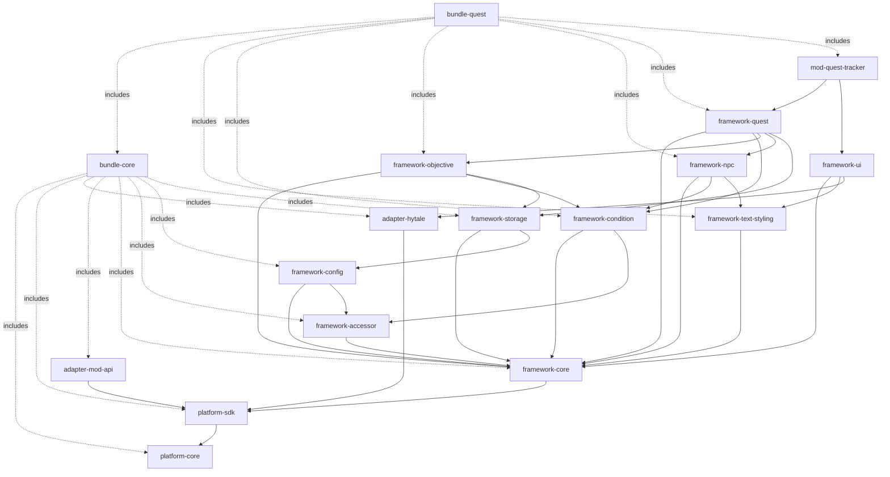

# Dependency Map

Visual guide to module dependencies and relationships in Argonath Systems.

## Complete Dependency Graph



## Layer-Based View

### Layer 1: Foundation
```
┌─────────────────┐
│  platform-core  │ ← No dependencies
└─────────────────┘
```

### Layer 2: SDK
```
┌─────────────────┐
│  platform-sdk   │
└────────┬────────┘
         │
    ┌────▼────┐
    │platform-│
    │  core   │
    └─────────┘
```

### Layer 3: Adapters & Core Framework
```
┌──────────────┐    ┌─────────────────┐
│adapter-hytale│    │ framework-core  │
└──────┬───────┘    └────────┬────────┘
       │                     │
   ┌───▼──────┐         ┌────▼────┐
   │platform- │         │platform-│
   │   sdk    │         │   sdk   │
   └──────────┘         └─────────┘
```

### Layer 4: Utility Frameworks
```
┌───────────┐  ┌──────────┐  ┌──────────┐  ┌──────────┐
│framework- │  │framework-│  │framework-│  │framework-│
│ accessor  │  │  config  │  │ storage  │  │   text   │
└─────┬─────┘  └────┬─────┘  └────┬─────┘  └────┬─────┘
      │             │              │             │
      └─────────────┴──────┬───────┴─────────────┘
                           │
                    ┌──────▼──────┐
                    │framework-   │
                    │   core      │
                    └─────────────┘
```

### Layer 5: Feature Frameworks
```
┌───────────┐  ┌──────────┐  ┌──────────┐
│framework- │  │framework-│  │framework-│
│condition  │  │objective │  │   npc    │
└─────┬─────┘  └────┬─────┘  └────┬─────┘
      │             │              │
      └─────────────┴──────┬───────┘
                           │
                    ┌──────▼──────┐
                    │framework-   │
                    │   quest     │
                    └─────────────┘
```

### Layer 6: Mods
```
┌──────────────────┐
│mod-quest-tracker │
└────────┬─────────┘
         │
    ┌────▼─────┐
    │framework-│
    │  quest   │
    └──────────┘
```

## Dependency Tables

### Platform Dependencies

| Module | Depends On | Type |
|--------|------------|------|
| platform-core | - | Foundation |
| platform-sdk | platform-core | API Layer |

### Adapter Dependencies

| Module | Depends On | Type |
|--------|------------|------|
| adapter-hytale | platform-sdk | Implementation |
| adapter-mod-api | platform-sdk | Implementation |

### Core Framework Dependencies

| Module | Depends On | Purpose |
|--------|------------|---------|
| framework-core | platform-sdk | Base utilities |
| framework-accessor | framework-core | Safe access patterns |
| framework-config | framework-core, framework-accessor | Configuration |
| framework-storage | framework-core, framework-config | Persistence |
| framework-text-styling | framework-core | Text formatting |

### Feature Framework Dependencies

| Module | Depends On | Purpose |
|--------|------------|---------|
| framework-condition | framework-core, framework-accessor | Conditions |
| framework-objective | framework-core, framework-condition, framework-storage | Objectives |
| framework-npc | framework-core, framework-condition, framework-text-styling | NPCs |
| framework-quest | framework-core, framework-condition, framework-objective, framework-npc, framework-storage | Quest system |
| framework-ui | framework-core, framework-text-styling, adapter-hytale | UI system |

### Mod Dependencies

| Module | Depends On | Purpose |
|--------|------------|---------|
| mod-quest-tracker | framework-quest, framework-ui | Quest UI |

## Transitive Dependencies

When you depend on a module, you also get all its dependencies.

### Example: framework-quest

```
framework-quest
├── framework-core
│   └── platform-sdk
│       └── platform-core
├── framework-condition
│   ├── framework-core (already included)
│   └── framework-accessor
│       └── framework-core (already included)
├── framework-objective
│   ├── framework-core (already included)
│   ├── framework-condition (already included)
│   └── framework-storage
│       ├── framework-core (already included)
│       └── framework-config
│           ├── framework-core (already included)
│           └── framework-accessor (already included)
├── framework-npc
│   ├── framework-core (already included)
│   ├── framework-condition (already included)
│   └── framework-text-styling
│       └── framework-core (already included)
└── framework-storage (already included)
```

**Total unique dependencies when using framework-quest:**
1. platform-core
2. platform-sdk
3. framework-core
4. framework-accessor
5. framework-config
6. framework-storage
7. framework-text-styling
8. framework-condition
9. framework-objective
10. framework-npc

## Bundle Composition

### bundle-core

```
bundle-core
├── platform-core
├── platform-sdk
├── adapter-hytale
├── adapter-mod-api
├── framework-core
├── framework-accessor
├── framework-config
└── framework-storage
```

**Total Modules:** 8

### bundle-quest

```
bundle-quest
├── [All of bundle-core] (8 modules)
├── framework-text-styling
├── framework-condition
├── framework-objective
├── framework-npc
├── framework-quest
└── mod-quest-tracker
```

**Total Modules:** 14

## Dependency Rules

### ✅ Allowed

- **Higher layer depends on lower layer**
  ```
  framework-quest → framework-condition ✓
  ```

- **Same layer peer dependencies**
  ```
  framework-quest → framework-npc ✓
  ```

- **Adapter depends on platform**
  ```
  adapter-hytale → platform-sdk ✓
  ```

### ❌ Forbidden

- **Lower layer depends on higher layer**
  ```
  platform-core → framework-quest ✗
  ```

- **Circular dependencies**
  ```
  framework-quest → framework-npc → framework-quest ✗
  ```

- **Adapter depends on frameworks**
  ```
  adapter-hytale → framework-quest ✗
  ```
  (Exception: framework-ui may depend on adapter)

## Gradle Dependency Examples

### Minimal Quest Mod

```gradle
dependencies {
    // Just use the bundle - includes everything
    implementation 'com.hytale.argonath:bundle-quest:1.0.0'
}
```

**Transitively includes:** All 14 modules

### Custom NPC Mod (No Quests)

```gradle
dependencies {
    implementation 'com.hytale.argonath:platform-core:1.0.0'
    implementation 'com.hytale.argonath:platform-sdk:1.0.0'
    implementation 'com.hytale.argonath:adapter-hytale:1.0.0'
    implementation 'com.hytale.argonath:framework-core:1.0.0'
    implementation 'com.hytale.argonath:framework-npc:1.0.0'
    // framework-npc brings in: condition, text-styling, accessor
}
```

**Total modules loaded:** ~8

### Minimal Utility Library

```gradle
dependencies {
    compileOnly 'com.hytale.argonath:platform-core:1.0.0'
    compileOnly 'com.hytale.argonath:framework-core:1.0.0'
}
```

**Runtime modules:** 0 (users provide)

## Version Matrix

All modules with same version are guaranteed compatible.

| Argonath Version | All Module Versions |
|------------------|---------------------|
| 1.0.0 | 1.0.0 |
| 1.1.0 | 1.1.0 |
| 2.0.0 | 2.0.0 |

### Mixed Version Example (Not Recommended)

```gradle
dependencies {
    implementation 'com.hytale.argonath:platform-core:1.0.0'
    implementation 'com.hytale.argonath:framework-quest:1.1.0'  // Might work
    implementation 'com.hytale.argonath:framework-quest:2.0.0'  // ⚠️ Likely breaks
}
```

## Circular Dependency Prevention

Argonath enforces **strict layering** to prevent circular dependencies:

```
Layer 6 (Mods)           ← Can use Layer 5
   ↑
Layer 5 (Features)       ← Can use Layer 4
   ↑
Layer 4 (Utilities)      ← Can use Layer 3
   ↑
Layer 3 (Core/Adapters)  ← Can use Layer 2
   ↑
Layer 2 (SDK)            ← Can use Layer 1
   ↑
Layer 1 (Platform)       ← No dependencies
```

**Rule:** A layer can only depend on layers below it.

## Build Order

When building from source, modules must be built in dependency order:

```bash
# Correct order
./gradlew :platform-core:build
./gradlew :platform-sdk:build
./gradlew :adapter-hytale:build
./gradlew :framework-core:build
./gradlew :framework-accessor:build
./gradlew :framework-config:build
# ... etc

# Or use the install script
./install-frameworks.sh
```

## Dependency Resolution

### Using Gradle

Gradle automatically resolves transitive dependencies:

```gradle
dependencies {
    implementation 'com.hytale.argonath:framework-quest:1.0.0'
    // Gradle fetches all transitive dependencies automatically
}
```

### Manual Resolution

If needed, you can see the full dependency tree:

```bash
./gradlew dependencies --configuration runtimeClasspath
```

Example output:
```
runtimeClasspath
└── com.hytale.argonath:framework-quest:1.0.0
    ├── com.hytale.argonath:framework-core:1.0.0
    │   └── com.hytale.argonath:platform-sdk:1.0.0
    │       └── com.hytale.argonath:platform-core:1.0.0
    ├── com.hytale.argonath:framework-condition:1.0.0
    │   └── ...
    └── ...
```

## Dependency Conflicts

### Common Conflicts

**Problem:** Two modules require different versions of the same dependency

**Example:**
```
module-a requires platform-core:1.0.0
module-b requires platform-core:1.1.0
```

**Gradle Resolution:** Uses newest version (1.1.0)

### Force Specific Version

```gradle
configurations.all {
    resolutionStrategy {
        force 'com.hytale.argonath:platform-core:1.0.0'
    }
}
```

### Best Practice

**Use consistent versions across all Argonath modules:**

```gradle
ext.argonathVersion = '1.0.0'

dependencies {
    implementation "com.hytale.argonath:platform-core:${argonathVersion}"
    implementation "com.hytale.argonath:framework-quest:${argonathVersion}"
    implementation "com.hytale.argonath:framework-ui:${argonathVersion}"
}
```

## Optimization Tips

### Exclude Unused Transitive Dependencies

```gradle
dependencies {
    implementation('com.hytale.argonath:framework-quest:1.0.0') {
        exclude group: 'com.hytale.argonath', module: 'mod-quest-tracker'
    }
}
```

**Warning:** Only exclude if you're certain it's not needed!

### Use compileOnly for Libraries

```gradle
dependencies {
    // Don't package these, users will provide
    compileOnly 'com.hytale.argonath:platform-core:1.0.0'
    compileOnly 'com.hytale.argonath:framework-core:1.0.0'
}
```

---

**Next:** [Modules Reference](modules.md) | [Core Concepts](concepts.md)
